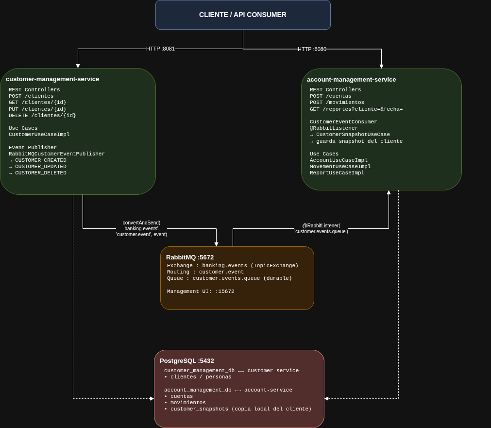

# java-springboot-microservices-challenge

Solución basada en dos microservicios Spring Boot con arquitectura hexagonal, comunicación asíncrona vía RabbitMQ y persistencia en PostgreSQL.

---

## Arquitectura



---

## Microservicios

### customer-management-service (puerto 8081)
Gestiona clientes. Cada vez que se crea, actualiza o elimina un cliente, publica un evento a RabbitMQ para que el otro servicio se mantenga sincronizado.

| Método | Endpoint | Descripción |
|--------|----------|-------------|
| POST | `/api/v1/clientes` | Crear cliente |
| GET | `/api/v1/clientes` | Listar clientes |
| GET | `/api/v1/clientes/{id}` | Obtener cliente |
| PUT | `/api/v1/clientes/{id}` | Actualizar cliente |
| PATCH | `/api/v1/clientes/{id}` | Actualización parcial |
| DELETE | `/api/v1/clientes/{id}` | Eliminar cliente |

### account-management-service (puerto 8080)
Gestiona cuentas y movimientos bancarios. Escucha los eventos de clientes desde RabbitMQ y guarda una copia local (snapshot) para no depender del otro servicio al generar reportes.

| Método | Endpoint | Descripción |
|--------|----------|-------------|
| POST | `/api/v1/cuentas` | Crear cuenta |
| GET | `/api/v1/cuentas/{id}` | Obtener cuenta |
| PUT | `/api/v1/cuentas/{id}` | Actualizar cuenta |
| POST | `/api/v1/movimientos` | Registrar movimiento |
| GET | `/api/v1/movimientos/{id}` | Obtener movimiento |
| GET | `/api/v1/reportes` | Reporte por cliente y rango de fechas (`?cliente=&startDate=&endDate=`) |

---

## Levantar con Docker Compose

### Requisitos
- Docker y Docker Compose instalados

### Comando

```bash
docker compose up --build -d
```

Esto levanta en orden:
1. **PostgreSQL** — crea las bases `customer_management_db` y `account_management_db`
2. **RabbitMQ** — broker de mensajes
3. **customer-management-service** — espera a que la BD y RabbitMQ estén listos
4. **account-management-service** — espera a los anteriores

### Detener los servicios

```bash
docker compose down
```

Para eliminar también los volúmenes (datos de BD):

```bash
docker compose down -v
```

---

## Documentación Swagger

Una vez levantados los servicios, acceder a:

| Servicio | URL |
|---------|-----|
| customer-management-service | http://localhost:8081/swagger-ui.html |
| account-management-service | http://localhost:8080/swagger-ui.html |

---

## Consola RabbitMQ

Acceder a la UI de administración:

```
URL:      http://localhost:15672
Usuario:  guest
Password: guest
```

Desde ahí se pueden ver los exchanges, colas y mensajes en tránsito. El exchange usado es `banking.events` y la cola es `customer.events.queue`.

---

## Tecnologías

- Java 21 + Spring Boot 4
- Arquitectura Hexagonal (Ports & Adapters)
- Spring Data JPA + PostgreSQL
- Spring AMQP + RabbitMQ
- SpringDoc OpenAPI (Swagger)
- Docker / Docker Compose

---

## Pipeline CI (GitHub Actions)

El proyecto incluye un pipeline de Integración Continua en GitHub Actions definido en `.github/workflows/ci.yml`.

Se ejecuta automáticamente en:
- `push` a cualquier rama
- `pull_request` desde/hacia cualquier rama

Flujo general del pipeline:
1. **Build**
	- Compila y empaqueta ambos microservicios (`account-management-service` y `customer-management-service`) con Java 21.
	- Ejecuta `./mvnw --batch-mode -DskipTests package` por servicio.
2. **Lint (Checkstyle)**
	- Corre en paralelo con los tests, después de que termine `build`.
	- Valida reglas de estilo con `checkstyle:check` usando el archivo compartido `checkstyle.xml` en la raíz del repositorio.
3. **Unit Tests**
	- Corre en paralelo con lint, después de `build`.
	- Ejecuta `./mvnw --batch-mode test` por servicio.
	- Publica los reportes de Surefire como artefactos para facilitar el diagnóstico cuando hay fallos.

Notas:
- El pipeline usa una estrategia tipo matriz para ejecutar los mismos pasos en ambos microservicios de forma consistente.
- Se utiliza caché de Maven para acelerar tiempos de ejecución.

